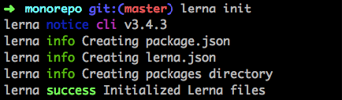
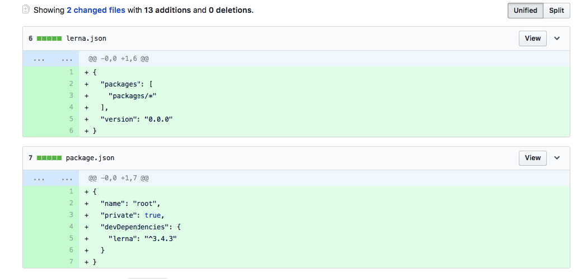
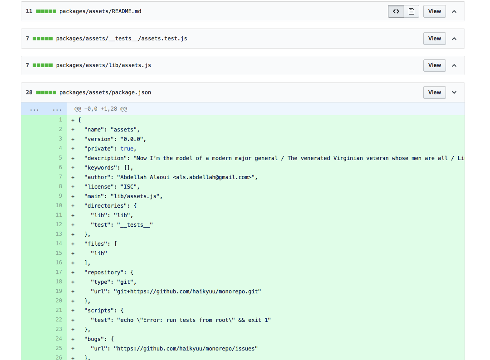
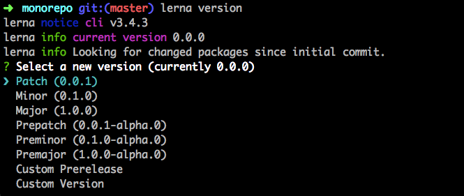
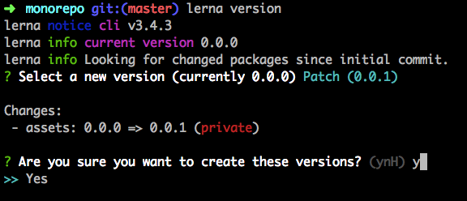
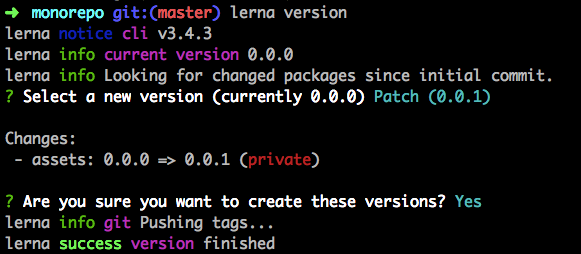
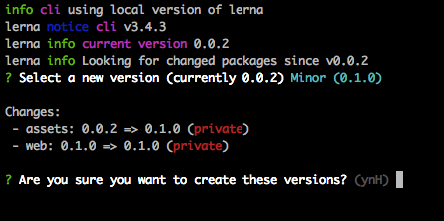

# monorepo

Monorepo using lerna - step by step tuto

## Preparation

- you should have lerna installed: `yarn global add lerna`

## [Step 1 - Init our monorepo](https://github.com/haikyuu/monorepo/commit/b3b1e5e6e4407c0b1104cb6a9a001384ad7edabc)

Let's run `lerna init`

Let's take a look at the content of those files:

## [Step 2 - let's create our first package](https://github.com/haikyuu/monorepo/commit/d015128d5d36c616b272cd6dd1ecb7c7c5a07e90)

Let's run `lerna create assets --private --yes`. This will create a folder in the packages folder with some default files.

## Step 3 - let's change some things in the assets package

- let's add the images of the previous steps in the `images` folder.
- And let's change the `assets.js` to output the number of images.

We wish to publish a new version of the assets package. 🤔 Let's see how we can do that.

- The `lerna publish` command [publishes to npm](https://github.com/lerna/lerna/tree/master/commands/publish#readme) ([source](https://github.com/lerna/lerna/blob/master/commands/publish/index.js#L18-L20)). 🤔 Not what we want, since this is a private package. In the [end of the Readme, there is a deprecated `skip-npm` option](https://github.com/lerna/lerna/tree/master/commands/publish#deprecated-options). It says "call `lerna version` directly"
- `lerna version`. 🚀

Oops, i have uncommited changes. Ok, let's get a clean git tree first.

It prompts to selection the new version, shows you a summary of the changes and then proceeds.

Notice the `pushing tags ...` in the end. So lerna works with [git tags (handy primer on tags in the link)](https://alblue.bandlem.com/2011/04/git-tip-of-week-tags.html).

Run `git tags -l` to see `v0.0.1` in the list.

And visit the [tags tab](https://github.com/haikyuu/monorepo/releases/tag/v0.0.1) in the github repo to see it there.

## Step 4 - let's add another package: a web app

Last time, we used `lerna create`. But we can also create a folder directly in the `packages` folder.

Let's run `create-react-app web` in the packages folder and **publish a new version** using `lerna version` command.

🤔 It seems that all of our packages will have the same version from now on.

Let's see if we can change that.

In the [lerna readme](https://github.com/lerna/lerna#independent-mode), there is `independent` flag. Let's add it to our `package.json`
